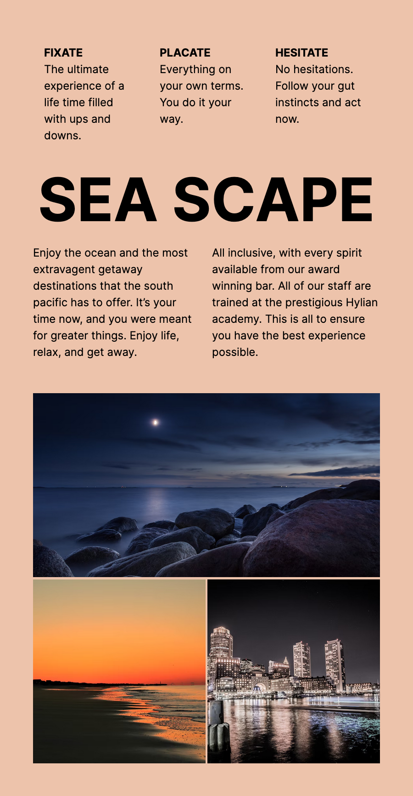

# Design Course - Sea scape solution

This is a solution to the Sea scape challenge on Design Course.

## Table of contents

- [Overview](#overview)
  - [The challenge](#the-challenge)
  - [Screenshot](#screenshot)
  - [Links](#links)
- [My process](#my-process)
  - [Built with](#built-with)
  - [What I learned](#what-i-learned)
  - [Continued development](#continued-development)
  - [Useful resources](#useful-resources)
- [Author](#author)
- [Acknowledgments](#acknowledgments)

## Overview

### The challenge

- Use HTML, CSS, and the Grid to construct the layout shown on the right.
- You can use Flexbox sparingly.

### Screenshot

### Links

- Solution URL: [https://github.com/javelwilson/dc-sea-scape](https://github.com/javelwilson/dc-sea-scape)
- Live Site URL: [https://javelwilson.github.io/dc-sea-scape](https://javelwilson.github.io/dc-sea-scape)

## My process

### Built with

- Semantic HTML5 markup
- CSS custom properties
- Flexbox
- CSS Grid
- Mobile-first workflow

### What I learned

### Continued development

### Useful resources

## Author

- Website - [Javel Wilson](https://javelwilson.com)

## Acknowledgemts